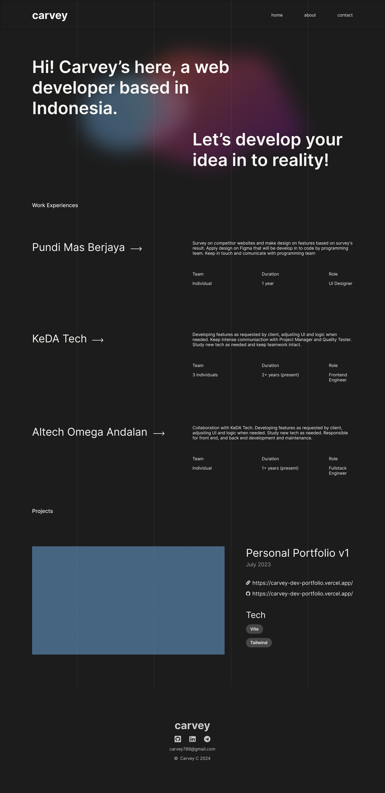

# carveych.com / Personal Website of Carvey Chennico

This is my personal website to show my profile, projects, professional experiences, services, socials, and more.\
Build using Astro, React, and Tailwind

## Requirement

- Node >= `v18.14.1`

## Run in local

- Install the package using `npm install`
- Run using `npm run dev`

## Links

- Website URL: [carveych.com](https://carveych.com)
- Github Repo: <https://github.com/>
- Figma File: <https://figma.com>

## Social media

- Telegram: [t.me/](https://t.me/)
- LinkedIn: [linkedin.com/in/](https://linkedin.com/)
- Github: [github.com/](https://github.com/)
- Facebook: [facebook.com/](https://facebook.com/)
- Instagram: [instagram.com/](https://instagram.com/)
- CV/Resume: [cv.carvey.dev](https://cv.carvey.dev/)

## Preview

### Home

